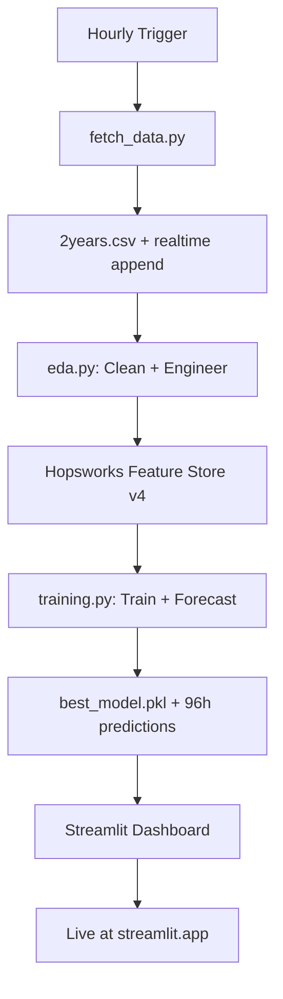

# **Karachi Air Quality Index (AQI) Forecasting System**  
   

---

## **Live Dashboard**  
https://aqiprediction-eonb5mngx64cdzpxqs62ko.streamlit.app/ 

---

## **Project Overview**

An **end-to-end, automated MLOps pipeline** that:

1. **Fetches** hourly air pollution data from **OpenWeatherMap API**
2. **Converts** OWM AQI → **US EPA AQI**
3. **Cleans & engineers** 30+ features (cyclical time, lags, rolling stats, interactions)
4. **Stores** versioned features in **Hopsworks Feature Store**
5. **Trains** 7 regression models (XGBoost, LightGBM, CatBoost, RF, GB, Ridge, Linear)
6. **Checkpoints** the best model (lowest **CV-MAE**)
7. **Forecasts** next **96 hours** hourly
8. **Deploys** interactive dashboard on **Streamlit Cloud**
9. Runs **hourly** via **GitHub Actions**

---

## **Tech Stack**

| Component | Technology |
|--------|------------|
| **Data Source** | OpenWeatherMap API (`/history`, `/air_pollution`, `/forecast`) |
| **Feature Store** | [Hopsworks](https://www.hopsworks.ai/) |
| **ML Models** | XGBoost, LightGBM, CatBoost, Scikit-learn |
| **Dashboard** | Streamlit (hosted on Streamlit Cloud) |
| **CI/CD** | GitHub Actions (3 workflows) |
| **Versioning** | Git + Hopsworks Feature Group (v4) |
| **Storage** | CSV + Pickle (artifacts) |

---

## **Pipeline Workflow**



---


## **Key Features**

| Feature | Description |
|-------|-----------|
| **US EPA AQI** | Accurate conversion from OWM units using official breakpoints |
| **Cyclical Encoding** | `hour_sin/cos`, `month_sin/cos` |
| **Target Lags** | `us_aqi_lag1`, `us_aqi_lag24` |
| **Rolling Stats** | 3-hour means for PM₂.₅, PM₁₀, CO |
| **Model Checkpointing** | Saves best model by **TimeSeries CV MAE** |
| **96-Hour Forecast** | Hourly predictions for next 4 days |
| **Live Dashboard** | Interactive plots, model comparison, error highlighting |

---

## **Setup & Run Locally**

### 1. **Clone the repo**
```bash
git clone https://github.com/Yusra-Munawwar/AQI_Prediction.git
cd AQI_Prediction
```

### 2. **Create `.env`**
```env
OWM_API_KEY=your_openweathermap_key
HOPSWORKS_API_KEY=your_hopsworks_key
```

### 3. **Install dependencies**
```bash
pip install -r requirements_training.txt
pip install "hopsworks[python]"
```

### 4. **Run pipeline**
```bash
# Step 1: Fetch data
python scripts/fetch_data.py

# Step 2: EDA + Hopsworks
python scripts/eda.py

# Step 3: Train + Forecast
python scripts/training.py
```

### 5. **Run Dashboard**
```bash
streamlit run app.py
```

---

## **GitHub Actions (Automated)**

| Workflow | Trigger | Frequency |
|--------|--------|----------|
| `fetch_data.yml` | Hourly + manual | Every hour |
| `eda.yml` | On `data-updated` dispatch | After fetch |
| `train.yml` | Hourly + manual | Every hour |

All artifacts are **committed and pushed** automatically.

---

## **API Endpoints Used**

| Purpose | URL |
|-------|-----|
| Historical (2 years) | `/data/2.5/air_pollution/history` |
| Realtime | `/data/2.5/air_pollution` |
| Forecast (96h) | `/data/2.5/air_pollution/forecast` |

---

## **Contributing**

1. Fork the repo
2. Create a feature branch
3. Commit changes
4. Push and open a Pull Request

---


> **"Breathe Easy, Forecast Smart"** – Powered by data, driven by code.  

--- 

*Last updated: November 09, 2025*
